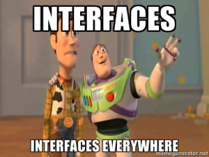

## [Interface segregation principle][1]

To me, this principle is the second important because it is an very effective
way to design loose coupled system.

Unlike LSP, ISP can be resumed in one phrase as "OOP is not a social network".
But there is a big prerequisite : you must have interfaces everywhere.



Objects are socially akward, they don't want attachment to many people 
and they don't want to deeply know their friends. Just the bare minimum to
follow the contract they need.

```php
public function getTotal(\SplFixedArray $listing)
{
    $sum = 0;
    foreach($listing as $row) {
        $sum += $row->getPrice()
    }

    return $sum;
}
```

Why using a SplFixedArray if we just need to traverse the array ?

```php
public function getTotal(\Iterator $listing)
{
    $sum = 0;
    foreach($listing as $row) {
        $sum += $row->getPrice()
    }

    return $sum;
}
```

Much better. If you have big interface, you know there is something wrong
with your design.

If you can't break your interface, then you might have some problem with SRP.

[1]: http://en.wikipedia.org/wiki/Interface_segregation_principle