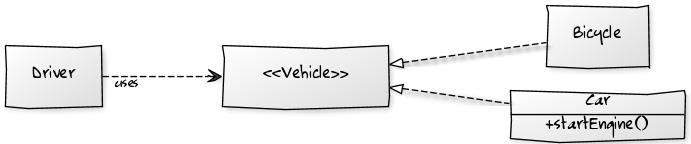

# [Liskov substitution principle][3]

To me, Liskov is the most important principle in SOLID. Mainly because, it can
be break in many ways, not just one or two.

The typical violation known as "[Circle-ellipse problem][2]" is too abstract to be
encountered in real-life coding.

LSP is more stronger than "Design by contract" so we must not break it
in the first place.



Imagine your driver only knows about cars :

```php
function driving(Car $vehicle)
{
    $vehicle->startEngine();
    $vehicle->forward();
}
```

You have failed in the first place : you must rely on interface (Vehicle) 
instead of concrete class (Car) to achieve the highest level of design by contract.

But then he knew about bicycle :

```php
function driving(Vehicle $vehicle)
{
    if ($vehicle instanceof Car) {
        $vehicle->startEngine();
    }
    $vehicle->forward();
}
```

Second, you have failed because you cannot safely substitute any subclasses of Vehicle
by another because of "special case" Car (instanceof). Unit tests get hard because
mockup are not straitforward.

But you can do worse :

```php
function driving(Vehicle $vehicle)
{
    if (get_class($vehicle) == 'Car') {
        $vehicle->startEngine();
    }
    $vehicle->forward();
}
```

LSP is patently violated, even subclasses of Car don't work in future.

[2]: http://en.wikipedia.org/wiki/Circle-ellipse_problem
[3]: http://en.wikipedia.org/wiki/Liskov_substitution_principle