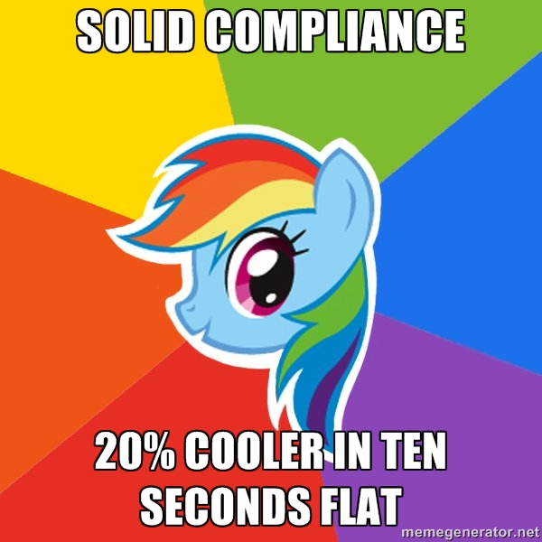

# You are not [SOLID][1] when...

Hay, here are some examples of anti-patterns concerning the SOLID principles.

Documentations about SOLID could be very boring because sometimes too abstract.

In this repo, I'll give you some (real-life or not) samples of what **not** to do. 

Now you know it is time for a meme picture :smile:

## Five principles
 * [Liskov substitution principle][3]
 * [Interface segregation principle][4]
 * [Single responsibility principle][5]
 * [Dependency inversion principle][6]
 * [Open/closed principle][7]

## Self promotion
I have made an analysis tool named [Mondrian][9] to find some problems with 
SOLID (and Demeter's Law) and help to refactor coupled code.

[1]: http://en.wikipedia.org/wiki/SOLID_(object-oriented_design)
[3]: ./LSP/README.md
[4]: ./ISP/README.md
[5]: ./SRP/README.md
[6]: ./DIP/README.md
[7]: ./OCP/README.md
[9]: https://github.com/Trismegiste/Mondrian